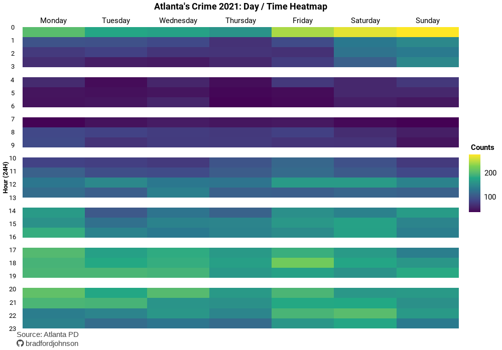

# Personal Data Visualization Projects
Objective
---

This repository is dedicated to my personal data visualization projects; it is here to share the `code` and creation process with others!

Visualization Gallery
---
### [2023 New Year's Resolution Tweets](https://github.com/bradfordjohnson/data-viz/tree/main/new-years-2023)
- Data collected using the `Twitter API` via the `rtweet` package.
- Pairwise correlation of words to see trends in user's resolutions.

---

### [RFID Tag Analysis](https://github.com/bradfordjohnson/data-viz/tree/main/rfid-tags)
- Using the `ggridges` package with the `tidyverse` to create a visual density ridgeline.
- With data based on historic records, this model / exploratory plot allows for the prediction of future time-based trends.
  - Predictions that can drive stakeholder decisions.
  - Also allows for visual time-based comparisons of a variable. 

---

### [Atlanta Crime 2021 Weekday / Time Heatmap](https://github.com/bradfordjohnson/data-viz/tree/main/day-time-heatmap)
- Using data from Atlanta Police Department, this visual shows overall crime trends by `weekday` and `hour` in 2021.
- Check out the [`README`](https://github.com/bradfordjohnson/data-viz/tree/main/day-time-heatmap) to see the trends of specific crimes in Atlanta.

