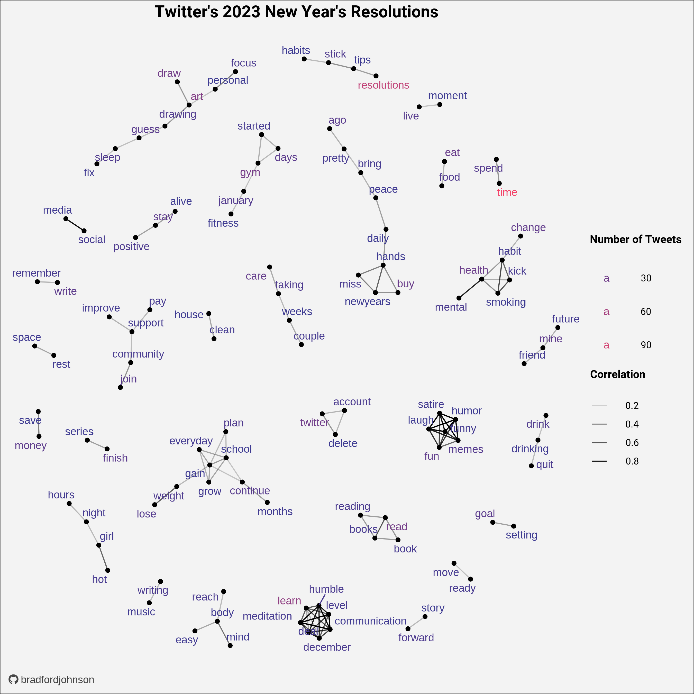

# Personal Data Visualization Projects
Objective
---

This repository is dedicated to my personal data visualization projects; it is here to share the `code` and creation process with others!

Visualization Gallery
---
### [Atlanta Crime Maps | 2021](https://github.com/bradfordjohnson/data-viz/tree/main/atlanta-crime-maps)
- Joining various sets of grouped crime data to a `.geojson` file to create the map with `ggplot2` and `sf` packages.
- Using the first dataset I began exploring and learning `R` with.
  - Created 4 uniform NPI heatmaps that show crime counts by **NPU** or **Neighborhood Planning Unit**.
  - `Burglary`, `Aggravated Assault`, `Auto Theft` and `Homicide`.

  
---
### [RFID Tag Analysis](https://github.com/bradfordjohnson/data-viz/tree/main/rfid-tags)
- Using the `ggridges` package with the `tidyverse` to create a visual density ridgeline.
- With data based on historic records, this model / exploratory plot allows for the prediction of future time-based trends.
  - Predictions that can drive stakeholder decisions.
  - Also allows for visual time-based comparisons of a variable. 

  
---
### [2023 New Year's Resolution Tweets](https://github.com/bradfordjohnson/data-viz/tree/main/new-years-2023)
- Data collected using the `Twitter API` via the `rtweet` package.
- Pairwise correlation of words to see trends in user's resolutions.

